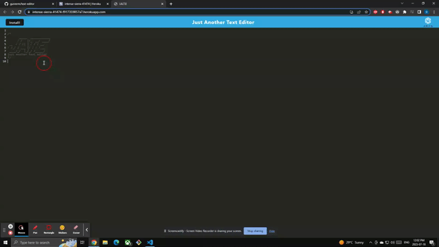

# Text Editor
   

## Description
A progressive web application that allows users to create notes or code snippets with or without an internet connection.
Visit the deployed application here: https://intense-sierra-41474-f917359857a7.herokuapp.com/

## Table of Contents
1. [Installation](#installation)
2. [Usage](#usage)
3. [License](#license)
4. [Questions](#questions)

## Installation
No installation is required, simply visit the deployed application here: https://intense-sierra-41474-f917359857a7.herokuapp.com/

## Usage
If users want to have access to the application without an internet connection simply click the `install` button at the top left of the header.

## License
This project is licensed under mit 
https://opensource.org/licenses/MIT

## Questions
If you have any additional questions regarding this project please contact me at `maduraigurveer@gmail.com`.
You can view more of my work at https://github.com/gurverm